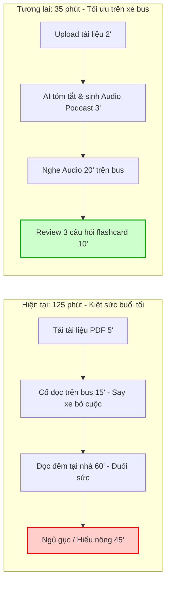

# 01 — Individual Problem Scan

> Điền theo Phase 1 + Phase 2 trong `01-worksheet.md`. Tự scan trước, dùng AI sau để phản biện. Không copy ví dụ Weekly Report.

## Thông tin cá nhân

- Họ và tên: Đặng Hữu Cương
- Mã học viên: 2A202602572
- Vai trò / bối cảnh: Sinh viên ngoại trú VinUni (di chuyển hàng ngày ~3 tiếng từ nội thành Hà Nội tới campus)
- Công việc hằng tuần:
  - Di chuyển bằng xe bus/VinBus đi học 5 ngày/tuần (mất ~3h/ngày cả đi và về)
  - Đọc tài liệu chuẩn bị bài, làm bài tập cá nhân và đồ án nhóm trên Canvas/Teams
  - Tham gia họp nhóm dự án với các bạn cùng lớp (nhiều bạn ở KTX/nội khu)
  - Theo dõi thông báo bài tập, hạn nộp trên nhiều kênh (Canvas, Discord, Messenger)

---

## Phase 1 — Scan 5+ problems (tối thiểu 5, khuyến khích 8-10)

**Cách điền:** mỗi dòng = việc gì + ai chịu + đo bằng gì. Cột `Dấu hiệu thật` bắt buộc có số: mất bao lâu (bấm giờ mấy lần), mấy lần/tuần, bao nhiêu người gặp, log/ticket/quote nào.

| # | Lăng kính (Lặp lại / Tốn thời gian / AI có thể tốt hơn / Pain từ người khác) | Problem quan sát được | Ai chịu ảnh hưởng? | Dấu hiệu thật (số + bằng chứng) |
|---|---|---|---|---|
| 1 | Tốn thời gian | Đọc và xử lý tài liệu học thuật (reading/slide 30–50 trang) bị nén vào buổi tối khi thể lực đã cạn kiệt sau 3h đi lại | Bản thân (sinh viên ngoại trú) | Mất 90–120'/tối; thường xuyên đọc đến trang 10 thì ngủ gục (3–4 lần/tuần); trễ hạn chuẩn bị bài trước giờ lên lớp |
| 2 | Lặp lại | Canh giờ, tra cứu lộ trình xe bus/VinBus và tính toán rủi ro tắc đường (cầu Vĩnh Tuy / cầu Chương Dương) mỗi sáng và chiều | Bản thân, sinh viên đi bus ngoại thành | Mất 15–20'/ngày check app VinBus, Google Maps, canh giờ ra trạm; lỡ 1 chuyến phải chờ 20–30', đi học muộn ít nhất 1 lần/tuần |
| 3 | AI có thể tốt hơn | Không thể tranh thủ học trên xe bus vì tài liệu PDF/Slide không tối ưu cho màn hình điện thoại và không gõ sâu được do rung lắc | Bản thân, sinh viên ngồi xe bus 3 tiếng/ngày | Lãng phí ~15h "thời gian chết"/tuần trên xe; đọc file PDF trên điện thoại bị mỏi mắt sau 15' và dễ say xe (motion sickness) |
| 4 | Pain từ người khác | Lệch nhịp làm việc nhóm do thành viên nội thành không thể tham gia họp trực tiếp buổi tối tại campus với các bạn ở KTX/nội khu | Bản thân | Nhóm phải dời lịch sang online lúc 21h30 hoặc bản thân phải xin recap; phát sinh 2–3 hiểu lầm về phân chia task/tuần trên Discord |
| 5 | Lặp lại | Lên thực đơn và chuẩn bị bữa ăn tối nhanh/đủ chất sau khi về nhà muộn và kiệt sức | Bản thân | Mất 30–45' đắn đo hoặc nấu nướng; 4/5 ngày trong tuần ăn đồ ăn nhanh/đặt GrabFood tốn thêm ~300.000đ - 400.000đ/tuần và mệt mỏi tiêu hóa |
| 6 | Tốn thời gian | Tổng hợp và bóc tách action items từ các thread chat/thông báo lớp sau cả ngày di chuyển không online thường xuyên | Bản thân, sinh viên không online liên tục | Mất 30–40' mỗi tối lội 5–7 nhóm chat (Teams/Messenger/Discord/Canvas) để gom deadline, dễ sót thông báo nộp bài hoặc tài liệu mới |
| 7 | AI có thể tốt hơn | Chuyển đổi ý tưởng / ghi chú giọng nói (voice memo) thu nhanh khi đang trên đường thành dàn ý bài tập/dự án hoàn chỉnh | Bản thân | Ghi âm 3–5 đoạn note (2–3'/đoạn) lúc ngồi trên xe nhưng tối về không có thời gian nghe lại để gõ lại thành text, bỏ phí 80% ý tưởng |
| 8 | | | | |
| 9 | | | | |
| 10 | | | | |

> Gợi ý tự soi: tuần trước mất nhiều thời gian nhất vào việc gì? Việc gì hay trì hoãn? Người khác hay hỏi lại câu gì? Workflow nào ai cũng biết là chậm?

**AI đã dùng ở Phase 1 (nếu có):**
- Prompt đã hỏi: "Tôi là sinh viên đi học ngoại thành mỗi ngày mất 3 tiếng di chuyển nội thành - VinUni, quỹ thời gian ít và mệt mỏi. Hãy đóng vai nhà phân tích và gợi ý 5-7 vấn đề cụ thể bóc tách từ bài toán này theo 4 lăng kính (Lặp lại, Tốn thời gian, AI có thể tốt hơn, Pain từ người khác) kèm số liệu đo lường cụ thể."
- Ý dùng được: Bóc tách thời gian di chuyển thành các pain points hệ quả cụ thể: thời gian chết không học được trên xe bus, cạn kiệt năng lượng làm bài tập đêm, lệch pha làm việc nhóm với các bạn ở nội khu/KTX, và phân mảnh thông tin bài tập.
- Ý bỏ vì không phải pain thật: Ý tưởng "AI tối ưu lộ trình tránh tắc đường cho xe bus" (vì tuyến VinBus chạy cố định theo lộ trình của ban quản lý, hành khách không tự can thiệp đổi đường được).

**Self-check Phase 1:**
- [x] Đủ 5+ dòng, mỗi dòng có actor + số đo cụ thể
- [x] Dùng ít nhất 3/4 lăng kính
- [x] Không có dòng chung chung kiểu "mất nhiều thời gian"

---

## Phase 2 — Top 3 Problem Cards

### 2.1. Chọn top 3

Giữ bài nào: actor cụ thể, workflow vẽ được 3-7 bước, bottleneck ở 1 bước, impact đo được. Loại bài quá rộng.

| Rank | Problem (copy từ bảng scan) | Vì sao chọn (2-3 ý) | Điều còn chưa chắc |
|---|---|---|---|
| 1 | Không thể tranh thủ học trên xe bus vì tài liệu PDF/Slide không tối ưu cho màn hình điện thoại và gây say xe (#3 & #1 biến tấu thành AI Audio) | 1. Tác động trực diện vào 15h "thời gian chết"/tuần trên xe bus.<br>2. Workflow rõ từ input tài liệu tới output âm thanh nghe on-the-go.<br>3. Giải phóng hoàn toàn áp lực học đêm sau khi kiệt sức. | Khả năng xử lý tài liệu chứa biểu đồ phức tạp, công thức hoặc code; chi phí chuyển đổi TTS giọng Việt/Anh tự nhiên. |
| 2 | Tổng hợp và bóc tách action items từ các thread chat/thông báo lớp sau cả ngày di chuyển không online thường xuyên (#6) | 1. Actor rõ, lặp lại mỗi tối (30-40'/ngày).<br>2. Dễ tích hợp parser/LLM để trích xuất entity (Deadline, Task, Môn).<br>3. Đo lường thành công rất rõ ràng (0 sót deadline). | Quyền truy cập API vào các nền tảng chat đóng (Messenger, Zalo) hoặc phải dùng manual copy-paste. |
| 3 | Lệch nhịp làm việc nhóm do thành viên nội thành không thể tham gia họp trực tiếp buổi tối tại campus với các bạn ở KTX/nội khu (#4) | 1. Đau đớn cho cả nhóm (3-4 người), giảm xung đột phân công.<br>2. Công nghệ Audio-to-Summary đã tương đối chín muồi.<br>3. Tiết kiệm 45-60' nghe lại ghi âm mỗi buổi. | Chất lượng âm thanh thu từ môi trường phòng họp offline nhiều tạp âm; tiếng nói chèn nhau khó tách speaker. |

### 2.2. Problem Cards chi tiết (lặp lại cho cả 3 cards)

---

#### Problem Card #1 — Chuyển đổi tài liệu học thuật thành AI Audio Podcast để học trên xe bus

```text
Problem 1 câu:
Sinh viên ngoại trú mất 3 tiếng đi lại mỗi ngày không thể đọc tài liệu học thuật (reading/slide 30–50 trang) trên xe bus do say xe và màn hình nhỏ, khiến việc học bị dồn vào buổi tối khi thể lực đã cạn kiệt.

Actor:
Sinh viên ngoại trú VinUni di chuyển 3h/ngày bằng xe bus.

Thời điểm / bối cảnh:
Khoảng thời gian 60–90 phút ngồi trên chuyến xe bus sáng/chiều và tối ở nhà trước buổi học ngày hôm sau.

Current workflow 3-7 bước:
1. Tải slide/PDF bài đọc từ Teams về điện thoại/laptop (5')
2. Mở file PDF đọc thử trên xe bus ➔ say xe, nhức mắt, bỏ dở sau 10-15' (15')
3. Về nhà lúc 19h00, ăn uống nghỉ ngơi đến 20h30 (90')
4. Bắt đầu mở tài liệu 30–50 trang ra đọc trong trạng thái mệt mỏi (60')
5. Đọc đến trang 10-15 thì ngủ gục hoặc đọc lướt không đọng lại kiến thức (30')
6. Lên lớp hôm sau trong trạng thái bị động, chưa chuẩn bị kỹ bài (15')

Bottleneck:
Bước 4 & 5 — Đọc tài liệu dài vào buổi tối khi thể lực và tâm trí đã kiệt sức sau 3h di chuyển, mất 90–120' nhưng tỷ lệ ghi nhớ rất thấp.

Impact:
Lãng phí 15h "thời gian chết"/tuần trên xe bus; mất 6–8h/tuần vật lộn học đêm; tăng nguy cơ trễ hạn bài tập và sụt giảm điểm chuyên cần/thảo luận trên lớp.

Success metric:
Chuyển hóa 30–45 phút trên xe bus thành thời gian tiếp thu bài hiệu quả; giảm thời gian đọc đêm từ 90-120' xuống dưới 30' (chỉ review lại key concept); 100% chuẩn bị bài trước giờ lên lớp.

Non-AI alternative:
In tài liệu ra giấy (vẫn gây say xe khi xe rung lắc) hoặc dùng ứng dụng Text-to-Speech mặc định trên điện thoại (đọc máy móc như robot, đọc cả header/footer/chú thích, không tóm tắt, nghe rất buồn ngủ và khó hiểu).

AI hypothesis:
AI tự động phân tích cấu trúc tài liệu PDF/Slide, loại bỏ thông tin rác, trích xuất 5-7 luận điểm cốt lõi, và sinh kịch bản đối thoại/podcast sinh động dài 15–20 phút (audio format) kèm 3 câu hỏi kiểm tra nhanh dạng trắc nghiệm.

Quick gut:
[ ] No AI / process fix
[ ] Rule
[x] Workflow
[ ] Agent
[ ] Chưa biết
```

**Draft workflow Card #1** (ASCII & Mermaid):

```text
CURRENT STATE — 125 phút (học buổi tối trong mệt mỏi)

[1. Tải PDF: 5'] → [2. Đọc thử trên bus (say xe, bỏ cuộc): 15'] → [3. Đọc đêm mệt mỏi: 60'] → [4. Ngủ gục / đọc lướt: 45']  <-- bottleneck

FUTURE STATE — 35 phút (học chủ động trên xe bus + review nhanh)

[1. Tải file vào tool: 2'] → [2. AI bóc tách & tạo Audio Podcast: 3'] → [3. Nghe 15-20' trên xe bus: 20'] → [4. Tự review 3 câu hỏi phản xạ: 10']  <-- human boundary

Fallback: nếu AI tóm tắt thiếu ý hoặc sai thuật ngữ thì mở bản tóm tắt 1 trang (1-page executive bullet points) đính kèm để đọc lướt lại.
```



File đính kèm (nếu vẽ riêng): `01-individual-problem-scan-workflow-card-1.png`

---

#### Problem Card #2 — Trích xuất Action Items và Deadline tự động từ các kênh chat/thông báo

```text
Problem 1 câu:
Sinh viên di chuyển ngoài đường cả ngày không theo dõi liên tục tin nhắn, mất 30–40 phút mỗi tối lội 5–7 kênh chat/thông báo để gom deadline và dễ bỏ sót nhiệm vụ quan trọng.

Actor:
Sinh viên học nhiều môn, tham gia nhiều đồ án nhóm và hoạt động lớp.

Thời điểm / bối cảnh:
20h30 – 21h30 mỗi tối sau khi hoàn thành chuyến đi học trở về nhà.

Current workflow 3-7 bước:
1. Mở lần lượt Canvas, MS Teams, Messenger, Discord (5')
2. Lội tin nhắn chưa đọc trong 5–7 nhóm môn học và nhóm dự án (15')
3. Đọc lướt qua các tin nhắn phiếm/thảo luận lan man để tìm thông báo thật (15')
4. Ghi chép thủ công các mốc deadline, link nộp bài vào sổ/Notion cá nhân (10')
5. Nhắn tin hỏi lại bạn bè/lớp trưởng để xác nhận xem có sót bài nào không (5')

Bottleneck:
Bước 2 & 3 — Phải đọc thủ công hàng trăm tin nhắn thảo luận không liên quan để lọc ra 1–2 thông báo bài tập/deadline, mất 25–30' mỗi tối.

Impact:
Mất 30–40'/ngày (~3h/tuần); trung bình 1–2 lần/kỳ bị nộp bài sát nút hoặc quên nộp bài tập nhỏ chiếm 5-10% điểm quá trình.

Success metric:
Giảm thời gian tổng hợp deadline từ 35' xuống dưới 5' mỗi tối; 0 trường hợp bị bỏ sót deadline bài tập.

Non-AI alternative:
Quy định ban cán sự lớp/trưởng nhóm phải lập Google Sheets tổng hợp deadline chung (phụ thuộc vào sự chăm chỉ của người khác, thường xuyên bị bỏ quên hoặc cập nhật chậm).

AI hypothesis:
Dùng AI Workflow quét/nhận đầu vào nội dung chat/thông báo (qua copy-paste hoặc webhook), tự động trích xuất các thực thể: [Môn học], [Tên bài tập], [Hạn nộp], [Link nộp] và đồng bộ vào to-do list cá nhân.

Quick gut:
[ ] No AI / process fix
[ ] Rule
[x] Workflow
[ ] Agent
[ ] Chưa biết
```

**Draft workflow Card #2:**

```text
CURRENT STATE — 40 phút

[1. Mở 4 app chat: 5'] → [2. Lội tin nhắn 7 group: 15'] → [3. Đọc lọc tin nhắn rác: 15']  <-- bottleneck → [4. Ghi sổ thủ công: 5']

FUTURE STATE — 5 phút

[1. Paste text/forward thông báo vào tool: 1'] → [2. AI trích xuất Deadline & Task: 1'] → [3. Sinh viên duyệt nhanh & sync Calendar: 3']  <-- human boundary

Fallback: Nếu AI parse sót deadline, đối chiếu nhanh qua tab "Announcements" chính thức trên Canvas LMS của trường.
```

File đính kèm: `01-individual-problem-scan-workflow-card-2.png`

---

#### Problem Card #3 — Bất đồng bộ hóa tóm tắt và Action Items từ các cuộc họp nhóm trực tiếp

```text
Problem 1 câu:
Sinh viên ở xa không thể tham gia họp trực tiếp buổi tối tại campus với các bạn ở KTX, phải nghe lại ghi âm dài 60–90 phút với nhiều tạp âm hoặc đọc recap sơ sài dẫn đến lệch nhịp và phân công sai task.

Actor:
Sinh viên ngoại trú và 3–4 thành viên trong nhóm đồ án môn học.

Thời điểm / bối cảnh:
Các buổi tối 20h00–22h00 khi nhóm tại KTX tụ tập làm việc chung còn sinh viên ngoại trú đã về nhà.

Current workflow 3-7 bước:
1. Nhóm ở campus bật máy ghi âm hoặc gọi Google Meet trong khi thảo luận trực tiếp (5')
2. Cuộc họp kéo dài 60–90 phút với nhiều câu chuyện lan man, âm thanh ồn ào (60')
3. Kết thúc họp, file ghi âm được gửi cho sinh viên ngoại trú ở nhà (5')
4. Sinh viên ngoại trú tua đi tua lại file ghi âm dài để tìm phần mình được giao (45')
5. Nhắn tin hỏi lại trưởng nhóm để xác nhận lại nhiệm vụ vì ghi chép không rõ (15')

Bottleneck:
Bước 4 — Mất 45–60' tua nghe lại file ghi âm chất lượng kém, không có cấu trúc để bóc tách phần việc của mình.

Impact:
Mất 45–60' cho mỗi buổi họp nhóm (2–3 buổi/tuần = 2h–3h); phát sinh 2–3 hiểu lầm về task mỗi dự án làm giảm tiến độ cả nhóm.

Success metric:
Giảm thời gian nắm bắt nội dung cuộc họp từ 60' xuống dưới 10'; 100% thành viên đồng thuận về task list và deadline ngay trong đêm.

Non-AI alternative:
Chỉ định 1 bạn thư ký gõ biên bản cuộc họp vào Google Docs (người ghi thường lười ghi chi tiết, chỉ ghi 3–4 gạch đầu dòng vắn tắt làm mất bối cảnh ra quyết định).

AI hypothesis:
Ứng dụng AI Speech-to-Text lọc tạp âm, nhận diện người nói (Diarization), tóm tắt các quyết định quan trọng (Key Decisions) và lập bảng phân công nhiệm vụ (Action Items: Ai làm - Việc gì - Deadline).

Quick gut:
[ ] No AI / process fix
[ ] Rule
[x] Workflow
[ ] Agent
[ ] Chưa biết
```

**Draft workflow Card #3:**

```text
CURRENT STATE — 70 phút (dành cho người nghe lại)

[1. Nhận file ghi âm 60': 5'] → [2. Tua nghe tìm phần việc: 45']  <-- bottleneck → [3. Nhắn hỏi lại confirm: 20']

FUTURE STATE — 8 phút

[1. Upload file ghi âm: 1'] → [2. AI sinh Minutes of Meeting & Action Items: 2'] → [3. Trưởng nhóm duyệt & tag thành viên: 5']  <-- human boundary

Fallback: Nếu AI nhận diện sai người nói, sinh viên search từ khóa tên mình trong bản transcript đầy đủ để kiểm tra lại câu nói gốc.
```

File đính kèm: `01-individual-problem-scan-workflow-card-3.png`

---

### 2.3. Card muốn pitch nhất (chuẩn bị 2 phút)

**Card tôi muốn pitch nhất:**

```text
Problem Card #1 — Chuyển đổi tài liệu học thuật (reading/slide) thành AI Audio Podcast & Micro-learning để học trên xe bus.
```

**Vì sao (2-3 câu: workflow gì, số đo gì, impact gì):**

```text
Đây là bài toán chạm đúng "nút thắt cổ chai" lớn nhất trong sinh hoạt của sinh viên ngoại trú: biến 15 tiếng "thời gian chết" và gây say xe mỗi tuần trên bus thành thời gian học tập chất lượng cao. Workflow rất rõ ràng từ khâu nhận file PDF học thuật dài 30-50 trang ➔ AI bóc tách cấu trúc và chuyển thành kịch bản podcast đối thoại 15-20 phút ➔ sinh viên nghe hiểu và review phản xạ ngay trên đường. Impact đo được cụ thể: cắt giảm thời gian đọc sách ban đêm từ 90-120 phút xuống dưới 30 phút, giải phóng hoàn toàn thể lực buổi tối và nâng tỷ lệ chuẩn bị bài trước giờ lên lớp lên 100%.
```

**Câu hỏi tôi muốn nhóm challenge (1-2 câu hỏi đúng chỗ yếu):**

```text
1. "Nếu tài liệu học thuật chứa nhiều biểu đồ trực quan, công thức toán hoặc mã nguồn (code) phức tạp, AI Audio làm sao diễn giải bằng lời nói mà không gây hiểu lầm hoặc mất tính chính xác?"
2. "Nghe audio thụ động (passive listening) trên xe bus ồn ào liệu có thực sự giúp nhớ kiến thức sâu để làm bài thi/thảo luận, hay chỉ tạo ra cảm giác an tâm ảo?"
```

**AI phản biện Card (nếu có):**
- Điểm yếu AI chỉ ra: AI nhận xét rằng việc chỉ nghe audio dễ khiến sinh viên phân tâm, không nắm được các định nghĩa chuẩn xác (verbatim definitions), và rất dễ gặp rủi ro "ảo giác" (hallucination) khi AI tóm tắt tài liệu chuyên ngành hẹp.
- Tôi sửa gì: Bổ sung thêm vào workflow: (1) Xuất kèm 1 bản tóm tắt "One-page Cheat Sheet" chỉ chứa key terms/công thức cốt lõi để lướt bằng mắt trong 2 phút; (2) Chèn 3 mốc ngắt quãng trong audio để người nghe tự trả lời câu hỏi phản xạ (Active Recall) thay vì chỉ nghe một chiều.

### Self-check nộp phần 01
- [x] Có 5+ problems + top 3 Cards đủ field
- [x] Mỗi Card có workflow trước/sau + bottleneck + metric + fallback
- [x] Đã chọn 1 card pitch + câu hỏi challenge
