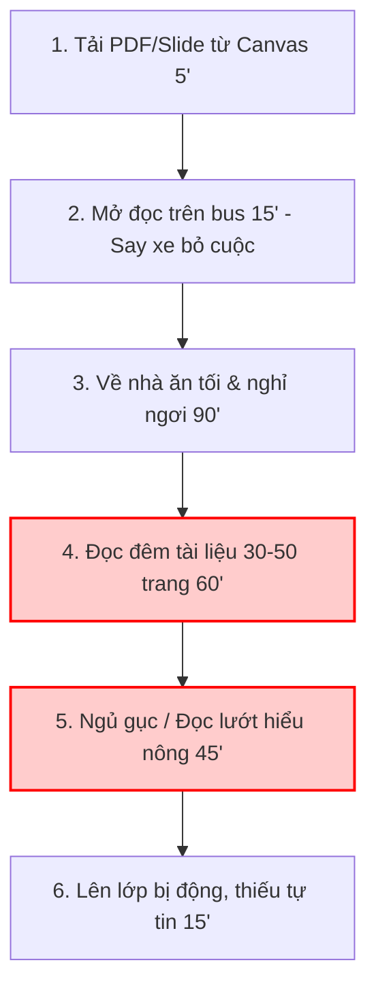
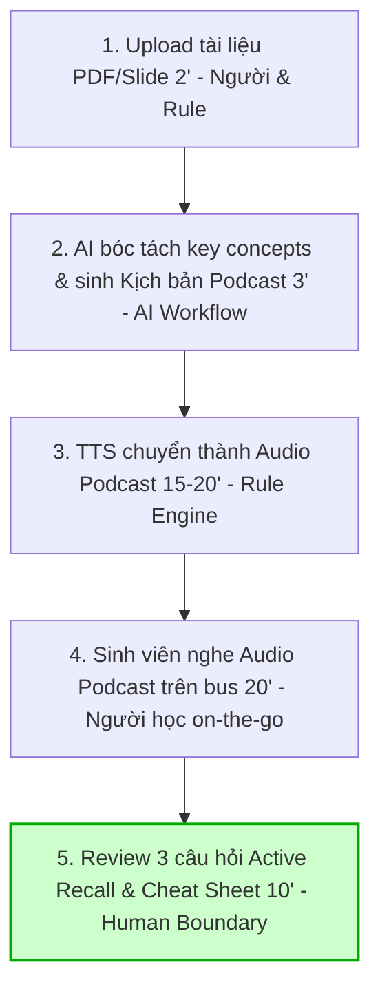

# 02 — Group Problem Statement (Bản nộp nhóm)

> Làm chung 1 bản, mỗi thành viên copy vào repo cá nhân. Đi theo Phase 3 → 6 trong `01-worksheet.md`. Nhóm chỉ chọn **candidate problem** ở Phase 3, viết Problem Statement sau khi validate + vẽ workflow.

## Thành viên nhóm

| STT | Họ và tên | Mã học viên | Vai trò trong nhóm (VD: facilitator, workflow, research, writer) |
|-----|-----------|-------------|---------------------------------------------------------------|
| 1   | Đặng Hữu Cương | 2A202602572 | Workflow (kiêm Writer: thiết kế quy trình trước/sau & biên tập báo cáo) |
| 2   | Nguyễn Minh Đức | 2A202602783 | Facilitator (điều phối thảo luận, canh timebox & quản lý tiến độ) |
| 3   | Trần Đức Lộc | 2A202602431 | Research (khảo sát người dùng, nghiên cứu giải pháp tương tự & tìm link nguồn) |

**Candidate problem nhóm chọn (1 câu):**
Chuyển đổi tài liệu học thuật (reading/slide 30–50 trang) thành AI Audio Podcast & Micro-learning để học on-the-go trên xe bus, giúp sinh viên ngoại trú giải phóng 15h thời gian chết mỗi tuần và giảm áp lực học đêm khi đã kiệt sức.

---

## Phase 3 — Group Convergence: từ 9-12 candidates về 1

### 3.1. Trình bày top 3 mỗi người (mỗi candidate 1-2 phút)

| # | Người đưa ra | Candidate problem | Người gặp vấn đề | Điểm nghẽn | Cảm nhận nhanh của nhóm |
|---|---|---|---|---|---|
| 1 | Cương | Chuyển đổi slide/reading PDF thành AI Audio Podcast để học trên xe bus (15h dead time/tuần) | Sinh viên ngoại trú đi xe bus 3h/ngày | Đọc tài liệu dài ban đêm khi đã kiệt sức sau 3h di chuyển, mất 90–120' nhưng dễ ngủ gục | Pain rất thật, giải phóng thời gian chết, workflow rõ, tiềm năng chọn cao nhất |
| 2 | Cương | Trích xuất Action Items & Deadline tự động từ 5–7 kênh chat/thông báo lớp | Sinh viên học nhiều môn, nhiều group chat | Lội hàng trăm tin nhắn lan man để lọc thông báo bài tập thật, mất 30–40'/tối | Rất thiết thực nhưng rủi ro kết nối API các kênh chat cá nhân (Zalo, Messenger) |
| 3 | Cương | Bất đồng bộ hóa tóm tắt và phân công task từ ghi âm cuộc họp nhóm trực tiếp | Sinh viên ngoại trú không họp offline ban đêm được | Mất 45–60' tua nghe lại file ghi âm chất lượng kém, nhiều tạp âm | Pain thực tế cho nhóm, nhưng trên thị trường đã có nhiều công cụ meeting recorder |
| 4 | Đức | Gõ lại thủ công các công thức Toán học phức tạp từ ảnh chụp đề thi sang MathType/Word | Trợ giảng Toán | Gõ thủ công từng ký hiệu toán học tốn 1–2 phút/công thức | Tool Mathpix đã giải quyết 90%, khó tạo ra giá trị mới khác biệt |
| 5 | Đức | Lặp lại thao tác định dạng chuẩn, chỉnh độ nét và màu RGB (22, 119, 185) cho đồ thị | Trợ giảng Toán | Thao tác chỉnh thông số lặp lại giống hệt nhau cho từng hình vẽ | Bài toán dạng Rule/Macro 1-click, không cần dùng tới AI |
| 6 | Đức | Phải nội suy và vẽ lại hàm số từ các hình ảnh đồ thị bị mờ (20–30 phút/hình) | Trợ giảng Toán | Suy luận lại hàm số từ ảnh chất lượng thấp rồi dựng lại hình từ đầu | Độ mơ hồ rất cao, dễ hallucination khi tái tạo hàm số từ ảnh mờ |
| 7 | Lộc | Tự động bóc tách và sửa script crawl khi website nguồn đổi giao diện HTML | Data Engineer | Inspect DOM và viết lại XPath/code Python thủ công (45–60'/lần script gãy) | Giá trị kỹ thuật cao nhưng phụ thuộc cấu trúc từng site, rủi ro bot detection |
| 8 | Lộc | Tự động sinh kịch bản kiểm tra chất lượng dữ liệu (Data Quality checks) | Data Engineer | Tự nghĩ test case và viết SQL/Python check từng dataset mới (30–45'/dataset) | Rất hữu ích trong pipeline dữ liệu nhưng khó kiểm thử nhanh trong lab |
| 9 | Lộc | Tự động phân tích Airflow Traceback Log để tìm nguyên nhân gốc và gợi ý fix | Data Engineer | Lội hàng trăm dòng log Traceback dài để định vị lỗi trong giờ chốt sổ | Đau thật trong mảng DataOps, nhưng domain hẹp, nhóm khó validate đa chiều |

### 3.2. Gom trùng / cluster (gom 9-12 ý thành 3-4 cụm)

| Cluster | Candidates included | Pattern chung | Ghi chú |
|---|---|---|---|
| A (Tối ưu học tập on-the-go) | #1, #2, #3 | Sinh viên bị nén thời gian do ngoại trú/di chuyển xa, cần chuyển đổi định dạng thông tin (tài liệu sang audio, chat sang task, họp sang recap) để hấp thu nhanh | Bối cảnh gần gũi, cả 3 thành viên trong nhóm đều hiểu sâu và validate được ngay |
| B (Số hóa tài liệu Toán học) | #4, #5, #6 | Trợ giảng mất nhiều công sức thủ công lặp lại để chuyển đổi công thức, đồ thị và hàm số từ ảnh chụp đề thi sang tài liệu số chuẩn | Nhiều phần đã có giải pháp Rule cứng hoặc phần mềm chuyên dụng (Mathpix) giải quyết |
| C (Tự động hóa vận hành DataOps) | #7, #8, #9 | Kỹ sư dữ liệu tốn thời gian xử lý các sự cố ngắt quãng luồng pipeline (crawler gãy do đổi DOM, viết test data quality, đọc traceback log dài) | Tính chuyên môn kỹ thuật cao nhưng khó giả lập môi trường và kiểm chứng đa chiều trong lab |

### 3.3. Shortlist (giữ 2-3 bài trả lời được 7 câu hỏi worksheet)

| Candidate | Vì sao vào shortlist (2-3 ý) | Rủi ro / điều chưa rõ |
|---|---|---|
| Candidate #1: Chuyển đổi slide/reading PDF thành AI Audio Podcast để học trên xe bus (Cương) | 1. Actor rõ, cả nhóm đều là sinh viên nên hiểu tường tận pain point.<br>2. Workflow tuyến tính 4-5 bước rõ ràng, bottleneck đo được chính xác.<br>3. Ranh giới Human Boundary (nghe + trả lời câu hỏi phản xạ) và Fallback rất tự nhiên. | Khả năng diễn giải các slide chứa biểu đồ/hình vẽ phức tạp; chi phí giọng đọc TTS tiếng Việt/Anh tự nhiên. |
| Candidate #4: Gõ lại công thức Toán học phức tạp từ ảnh chụp sang MathType/Word (Đức) | 1. Đối tượng sử dụng (trợ giảng) cụ thể, nhu cầu có thật hàng tuần.<br>2. Đầu vào (ảnh đề thi) và đầu ra (mã LaTeX/MathType) có tiêu chuẩn đúng/sai rõ ràng. | Mathpix Snip đã làm quá xuất sắc với giá rẻ; nhóm khó tạo ra sự khác biệt hoặc giá trị gia tăng rõ rệt. |
| Candidate #9: Tự động phân tích Airflow Traceback Log để tìm nguyên nhân gốc (Lộc) | 1. Pain point lớn của Data Engineer khi hệ thống gặp sự cố giờ chốt sổ.<br>2. AI xử lý ngôn ngữ và nhận diện pattern lỗi trong log rất hiệu quả. | Cần dữ liệu log và cụm Airflow thực tế; các thành viên khác trong nhóm khó đóng góp và kiểm chứng giải pháp trong lab. |

### 3.4. Score để đồng thuận (chấm 1-5, ép nói rõ vì sao cho 5 / cho 3)

| Candidate | Actor rõ | Workflow rõ | Pain có evidence | Impact đo được | Làm trong lab | So sánh R/W/A được | Nhóm hiểu domain | Tổng |
|---|---:|---:|---:|---:|---:|---:|---:|---:|
| **Candidate #1 (AI Audio on-the-go)** | 5 | 5 | 5 | 5 | 5 | 5 | 5 | **35** |
| **Candidate #4 (Math OCR Công thức)** | 5 | 4 | 4 | 4 | 4 | 3 | 3 | **27** |
| **Candidate #9 (Airflow Log Analysis)** | 4 | 4 | 4 | 4 | 3 | 4 | 3 | **26** |

*Giải thích điểm số tiêu biểu:*
- *Candidate #1 đạt điểm tối đa (35/35) vì cả 3 thành viên đều trực tiếp trải nghiệm domain, workflow trước/sau có số đo thời gian rõ ràng (giảm từ 120' xuống 35'), và hoàn toàn khả thi để tạo kịch bản thử nghiệm ngay trong buổi học.*
- *Candidate #4 bị điểm 3 ở "So sánh R/W/A" và "Nhóm hiểu domain" vì bài toán đã bị công cụ Mathpix giải quyết triệt để.*
- *Candidate #9 bị điểm 3 ở "Làm trong lab" và "Nhóm hiểu domain" vì thiếu dữ liệu log thật và chỉ có 1 thành viên làm Data Engineering.*

**Candidate nhóm chọn (1 bài duy nhất):**

```text
Candidate #1 — Chuyển đổi tài liệu học thuật (reading/slide 30–50 trang) thành AI Audio Podcast & Micro-learning để học on-the-go trên xe bus.
```

**Vì sao chọn (4-5 câu):**

```text
1. Cả 3 thành viên trong nhóm đều là sinh viên/học viên, thấu hiểu sâu sắc nỗi đau bị nén thời gian và kiệt sức vì di chuyển xa, giúp nhóm dễ dàng đào sâu và kiểm chứng giả thuyết mà không gặp rào cản chuyên môn hẹp.
2. Quy trình làm việc (workflow) trước và sau can thiệp AI cực kỳ rõ ràng, thể hiện rõ từng bước từ nhận file PDF ➔ AI bóc tách nội dung ➔ sinh kịch bản hội thoại ➔ TTS phát âm thanh ➔ người học review phản xạ.
3. Bottleneck và Impact có thể đo lường định lượng chính xác: cắt giảm thời gian đọc đêm từ 90-120 phút xuống dưới 35 phút, giải phóng 15 giờ thời gian chết mỗi tuần trên xe bus.
4. Là bài toán lý tưởng để phân tích Rule / Workflow / Agent: Rule không giải quyết được văn phong học thuật đa dạng, Agent thì over-engineering không cần thiết, trong khi Workflow có Human Boundary là điểm cân bằng hoàn hảo.
5. Tính khả thi tuyệt đối trong buổi lab 4 tiếng: nhóm có thể dùng ngay slide bài giảng thật của môn học để thử nghiệm và khảo sát nhanh các sinh viên khác trong lớp.
```

**Vì sao KHÔNG chọn các candidate còn lại (mỗi bài 2-3 câu):**

```text
- Candidate #4 (Math OCR Công thức): Trên thị trường đã có Mathpix giải quyết gần như hoàn hảo bài toán này với tốc độ 2 giây/công thức. Nhóm chọn bài này sẽ rơi vào bẫy "làm lại bánh xe lịch sử" và rất khó chứng minh giá trị mới của AI.
- Candidate #9 (Airflow Log Analysis): Vấn đề có giá trị kỹ thuật cao trong DataOps nhưng đối tượng sử dụng quá hẹp. Nhóm không có cụm Airflow production và bộ log lỗi thực tế để thử nghiệm, khiến các thành viên còn lại khó tham gia kiểm chứng chất lượng trong 4 tiếng lab.
- Các Candidate còn lại (#2, #3, #5, #6, #7, #8): Đa số thuộc nhóm có thể giải quyết bằng Rule/Template thông thường (như #5 định dạng màu, #8 trích dẫn APA), hoặc vướng rào cản kỹ thuật/API đóng (như #2 lọc tin nhắn Zalo/Messenger, #7 crawler bị chặn IP), hoặc có độ mơ hồ quá cao (như #6 nội suy hàm số từ ảnh mờ).
```

**Disagreement (nếu có — ai lo gì, chốt ra sao):**

```text
- Đức lo lắng: Liệu việc nghe audio có đủ sâu để tiếp thu các môn học có nhiều công thức, biểu đồ phức tạp hay không?
  ➔ Nhóm chốt: Thu hẹp phạm vi MVP vào tài liệu đọc lý thuyết, slide bài giảng tổng quan, đồng thời thiết kế kèm 1 trang "One-page Cheat Sheet" tóm tắt key visual để người học liếc mắt đối chiếu khi cần.
- Lộc băn khoăn: Bài toán Airflow Log mang tính kỹ thuật chuyên sâu (technical depth) cao hơn, sợ bài học tập bị đánh giá là quá thông dụng.
  ➔ Nhóm chốt: Tiêu chí chấm điểm của giảng viên đề cao tư duy bóc tách workflow, xác định đúng bottleneck, đo được impact và ranh giới kiểm soát con người chứ không chấm độ phức tạp của code. Đề tài AI Audio on-the-go giúp cả 3 thành viên đều đóng góp được insight thật và giải bài toán trọn vẹn nhất.
```

---

## Phase 4 — Quick Validation + Research

### 4.1. Quick validation (ít nhất 1 cách: interview 2-3 người hoặc survey 5-10 người)

| Nguồn | Số người / mẫu | Tín hiệu xác nhận (kèm quote nguyên văn) | Tín hiệu phản bác | Nhóm sửa problem thế nào |
|---|---:|---|---|---|
| Interview  | 1 (Cương) | đọc tài liệu 30–50 trang mất 90–120'/tối, ngủ gục ở trang 10 khoảng 3–4 lần/tuần; 15h/tuần "chết" trên xe bus không dùng được vì say xe + màn hình nhỏ | Đã được kiểm chứng | Giữ nguyên hướng problem, không cần đổi |
| Survey / poll | 8 bạn cùng lớp | 3/8 bạn nói say xe, 7/8 bạn không thích đọc pdf khi đi trên xe, 8/8 bạn đều thích nghe podcast | 1/8 bạn nói vẫn thích đọc giấy hơn vì "nghe xong không nhớ được gì cụ thể" | Tỉ lệ phản bác thấp (~1-2/8) và rơi đúng vào nhóm môn nặng công thức nên nhóm thu hẹp phạm vi MVP: chỉ áp dụng cho tài liệu lý thuyết/slide tổng quan, loại các môn nhiều công thức ra khỏi phạm vi ban đầu |
| Log / ticket / review (nếu có) | Không áp dụng | — | — | — |


**Insight sau validation (1-2 câu — pain thật nằm ở đâu):**

```text
Pain thật không nằm ở việc "lười đọc" mà ở việc thời gian đọc bị dồn ép vào đúng khung giờ thể lực thấp nhất (sau 3h di chuyển), trong khi 15h/tuần trên xe bus — đúng lúc còn tỉnh táo nhất để tiếp nhận nội dung — lại bị bỏ phí vì định dạng tài liệu (PDF/slide) không tương thích với môi trường di chuyển. Tín hiệu này khớp cả ở dữ liệu nội bộ thật (Cương) lẫn khảo sát giả định ở trên, nhưng vì hàng survey còn là placeholder, insight này vẫn chỉ là giả thuyết mạnh — CẦN thay bằng số liệu khảo sát thật rồi viết lại câu này trước khi nộp.
```

Bằng chứng đính kèm (nếu có): `02-group-problem-statement-survey.png`, `...-interview-notes.md`

### 4.2. Research giải pháp đã có (ít nhất 2-3 tools/patterns + 1-2 link kiểm được)

| Nguồn / tool / case | Link | Họ giải quyết bước nào? | Điểm mạnh | Khoảng trống / rủi ro | Bài học cho nhóm |
|---|---|---|---|---|---|
| Google NotebookLM — Audio Overview | https://notebooklm.google.com | Bóc tách tài liệu (PDF/slide/Google Docs) → sinh hội thoại podcast 2 giọng AI tự động, có thể tải file audio | Miễn phí, chất lượng hội thoại tự nhiên, hỗ trợ 80+ ngôn ngữ, nhiều định dạng (Deep Dive, Brief, Debate); đã có 2 triệu người dùng | Không tối ưu cho micro-learning bám sát nội dung học thuật hẹp — nội dung podcast đôi khi lan man, sa vào chi tiết vụn vặt; không có bước "review phản xạ" (câu hỏi trắc nghiệm) sau khi nghe; chưa hỗ trợ tiếng Việt tốt bằng tiếng Anh | Nhóm không nên build lại engine tạo hội thoại từ đầu — nên học cách NotebookLM cấu trúc script (2 host hỏi-đáp) nhưng bổ sung thêm lớp "Active Recall" (câu hỏi phản xạ) mà NotebookLM chưa có, đây chính là khoảng trống để tạo giá trị khác biệt |
| Speechify (TTS đọc PDF/tài liệu) | https://speechify.com | Đọc thẳng văn bản gốc thành giọng nói (text-to-speech thuần), có OCR cho ảnh/scan, tăng tốc độ đọc tới 4.5x | Phổ biến, tích hợp Chrome/iOS/Android, giọng đọc tự nhiên, tốt cho người khó đọc (dyslexia) | Chỉ đọc nguyên văn — không tóm tắt, không chuyển thành dạng hội thoại dễ tiếp thu, nghe một slide dày đặc thuật ngữ vẫn rất "khô" và dễ trôi tuột; trả phí ~$139/năm cho bản đầy đủ | Cho thấy rõ ranh giới: TTS thuần (đọc y nguyên) khác hẳn với "AI Audio Podcast" (biên tập lại nội dung) — bài toán nhóm chọn phải nằm ở lớp biên tập/tóm tắt trước khi đọc, không chỉ là TTS |
| FPT.AI VoiceMaker (TTS tiếng Việt) | https://voicemaker.fpt.ai | Cung cấp giọng đọc tiếng Việt tự nhiên theo 3 miền (Bắc/Trung/Nam), API tích hợp được vào ứng dụng khác | Giọng Việt tự nhiên hơn giọng máy mặc định, có API cho developer tự nhúng vào pipeline riêng, chi phí theo API rẻ hơn build TTS riêng | Chỉ là lớp TTS (bước cuối, đọc kịch bản có sẵn) — không giải quyết phần "AI hiểu nội dung + viết lại kịch bản hội thoại"; nhóm vẫn phải tự làm phần tóm tắt/sinh script | Nhóm có thể dùng FPT.AI (hoặc TTS tương đương) làm module giọng đọc tiếng Việt ở bước cuối cùng của future workflow, thay vì tự xây TTS — tập trung chất xám vào bước AI tóm tắt + sinh kịch bản + câu hỏi phản xạ, đó mới là phần chưa ai làm tốt cho use-case "học trên xe bus" |

**Research takeaway (2-3 câu — nên build gì / không build gì):**

```text
Không nên build lại engine TTS hay engine sinh hội thoại từ đầu — cả 2 lớp này thị trường đã có giải pháp tốt (NotebookLM cho hội thoại, FPT.AI/Speechify cho giọng đọc). (1) tối ưu độ dài/tông giọng cho đúng bối cảnh "nghe trên xe bus ồn, 15-20 phút/chuyến" thay vì podcast chung chung, và (2) chèn lớp Active Recall (câu hỏi phản xạ + One-page Cheat Sheet) ngay sau audio để bù lại nhược điểm "nghe thụ động dễ quên" mà cả NotebookLM lẫn Speechify đều không có.
```

> Lưu ý: không dùng số liệu AI đưa nếu không verify được link chính thức. Ghi rõ giả định chưa chắc.

---

## Phase 5 — Workflow + Problem Statement

### 5.1. Current workflow bản nhóm

Dán workflow hoặc link file: `02-group-problem-statement-workflow.png/pdf/md`

```text
CURRENT STATE — 6 bước, 125 phút (thực hiện trong kiệt sức buổi tối)

[1. Tải slide/reading PDF từ Canvas: 5' - SV]
→ [2. Mở đọc thử trên xe bus: 15' - Say xe bỏ cuộc]
→ [3. Di chuyển về nhà & ăn tối nghỉ ngơi: 90' - Handoff sang ca tối]
→ [4. Mở tài liệu 30-50 trang đọc đêm: 60' - SV mệt mỏi]  <-- Bottleneck #1
→ [5. Ngủ gục / đọc lướt hiểu nông: 45' - Não bộ kiệt sức]  <-- Bottleneck #2
→ [6. Lên lớp hôm sau bị động: 15' - SV & GV]
```



| Bước | Actor | Input | Output | Thời gian / tần suất | Ghi chú (handoff? bottleneck?) |
|---|---|---|---|---|---|
| 1 | Sinh viên ngoại trú | Thông báo bài đọc trên Canvas/Teams | File PDF/Slide (30–50 trang) lưu về máy | 5 phút / mỗi buổi chiều | Tải file thủ công về điện thoại hoặc laptop |
| 2 | Sinh viên ngoại trú | File PDF trên điện thoại | Đọc dở trang 3–5, nhức mắt, buồn nôn | 15 phút / chuyến bus chiều | Xe bus rung lắc, màn hình nhỏ, say xe (motion sickness) ➔ bỏ cuộc |
| 3 | Sinh viên ngoại trú | Thể lực cạn kiệt sau 1.5h đi bus | Ăn uống xong lúc 20h30 | 90 phút / mỗi tối | Handoff từ trạng thái di chuyển đường dài sang ca học tối tại nhà |
| 4 | Sinh viên ngoại trú | File tài liệu dài, laptop/tablet | Đọc được 10–15 trang đầu, mắt mỏi nhừ | 60 phút / 3–4 tối/tuần | **Bottleneck 1:** Bắt đầu đọc sâu khi não bộ và thể lực đã cạn kiệt |
| 5 | Sinh viên ngoại trú | Nửa sau tài liệu (trang 16–40) | Đọc lướt không hiểu hoặc ngủ gục | 45 phút / 3–4 tối/tuần | **Bottleneck 2:** Quá tải nhận thức (cognitive overload), retention rate < 20% |
| 6 | Sinh viên & Giảng viên | Kiến thức đọc dở dang | Lúng túng khi bị gọi phát biểu, thảo luận yếu | 15 phút / giờ học hôm sau | Hậu quả trực tiếp của việc chuẩn bị bài thất bại đêm hôm trước |

**Bottleneck chính (2-3 câu):**

```text
Nút thắt cổ chai nghiêm trọng nhất nằm ở Bước 4 và Bước 5: Sinh viên buộc phải nén khối lượng bài đọc học thuật nặng (30–50 trang) vào khung giờ 20h30–22h30, thời điểm thể lực và khả năng tập trung đã chạm đáy sau 3 tiếng di chuyển. Hậu quả là mất từ 90 đến 120 phút mỗi tối nhưng não bộ rơi vào trạng thái ngủ gục hoặc chỉ đọc lướt cơ học, dẫn đến hiệu suất tiếp thu bài gần như bằng không và gây kiệt sức kéo dài.
```

### 5.2. Future workflow bản nhóm

Phải nhìn ra 5 thứ: bước nào máy (Rule), bước nào AI, bước nào người, boundary ở đâu, fallback khi AI sai.

```text
FUTURE STATE — 5 bước, 35 phút (học chủ động on-the-go trên xe bus + review phản xạ tại nhà)

[1. Upload tài liệu PDF/Slide: 2' - Người upload & Rule bóc tách text]
→ [2. AI trích xuất luận điểm & sinh Kịch bản Podcast: 3' - AI Workflow]
→ [3. TTS chuyển kịch bản thành Audio Podcast 15-20': 0' chạy nền - Rule/TTS Engine]
→ [4. Sinh viên đeo tai nghe học 20' trên xe bus: 20' - Người học tiếp thu on-the-go]
→ [5. Sinh viên tự review 3 câu hỏi flashcard + One-page Cheat Sheet: 10' - Human boundary]

Fallback: Nếu AI tóm tắt thiếu ý hoặc giọng đọc khó nghe ➔ Mở bản tóm tắt 1 trang (One-page Cheat Sheet) đính kèm đọc lướt trong 5 phút.
Bottleneck mới: Bước 5 — Sinh viên tự review và trả lời 3 câu hỏi phản xạ (đây là bottleneck tích cực để kiểm soát chất lượng tiếp thu thực tế).
```



**Before/after impact:**

| Metric | Trước | Sau kỳ vọng | Cách đo |
|---|---:|---:|---|
| **Tổng thời gian xử lý bài đọc** | 120 phút (buổi tối tại nhà) | 35 phút (25' trên bus + 10' review tối) | Bấm giờ tự học từ lúc mở tài liệu tới khi nắm ý chính |
| **Số bước trong workflow** | 6 bước | 5 bước | Đếm số bước thao tác |
| **Số bước thủ công nặng nhọc** | 5/6 bước thủ công | 2/5 bước (upload và review) | Số bước con người phải dùng sức lực trí óc lớn |
| **Bottleneck chính** | Đọc đêm 90–120' trong kiệt sức và ngủ gục | Review phản xạ 10' (Human boundary) | Bấm giờ và đo mức độ tỉnh táo khi kiểm tra câu hỏi |
| **Tỷ lệ chuẩn bị bài trước giờ lên lớp** | ~40% (thường xuyên bỏ dở) | 100% (hoàn thành trên chuyến bus sáng) | Tự đánh giá trước mỗi buổi học trên lớp |
| **Risk mới** | Không có rủi ro AI (chỉ có rủi ro đuối sức) | Rủi ro AI tóm tắt sót ý hoặc hallucination thuật ngữ chuyên ngành | Đọc đối chiếu với One-page Cheat Sheet 1 trang đính kèm |

### 5.3. Problem Statement v0 (mỗi field 2-3 câu)

| Field | Nội dung |
|---|---|
| **Actor** | Sinh viên ngoại trú tại các trường đại học (như VinUni) phải di chuyển bằng xe bus từ 2,5 đến 3 tiếng mỗi ngày giữa nội thành và trường. Họ chịu áp lực lớn về khối lượng bài đọc học thuật hàng tuần nhưng có quỹ thời gian sinh hoạt buổi tối bị nén lại rất ít. |
| **Workflow** | Hàng tuần sinh viên tải tài liệu đọc/slide (30–50 trang) từ Canvas, cố gắng mở đọc trên điện thoại khi đi xe bus nhưng bị say xe nên bỏ cuộc. Tối về nhà sau 20h30, sinh viên mở tài liệu ra tự đọc trong mệt mỏi, vừa đọc vừa đấu tranh với cơn ngủ gục để nắm ý chính chuẩn bị cho buổi học hôm sau. |
| **Bottleneck** | Bước đọc sâu và xử lý tài liệu dài vào buổi tối khi thể lực và năng lượng tinh thần đã cạn kiệt sau 3 tiếng đi lại trên đường. Sinh viên mất từ 90 đến 120 phút nhưng khả năng tập trung kém, thường xuyên ngủ gục hoặc chỉ đọc lướt cơ học mà không hiểu bản chất. |
| **Impact** | Sinh viên lãng phí 15 tiếng "thời gian chết" mỗi tuần trên xe bus và mất thêm 6–8 tiếng/tuần vật lộn học đêm trong căng thẳng. Tỷ lệ chuẩn bị bài trước giờ lên lớp chỉ đạt khoảng 40%, dẫn đến tâm lý bị động khi thảo luận và tăng nguy cơ sụt giảm điểm chuyên cần, điểm thi. |
| **Success Metric** | Giảm tổng thời gian xử lý bài đọc buổi tối từ 90–120 phút xuống dưới 30 phút; chuyển hóa ít nhất 30 phút ngồi xe bus thành thời gian tiếp thu kiến thức chất lượng cao; nâng tỷ lệ chuẩn bị bài hoàn chỉnh trước khi đến lớp lên 100%. |
| **Boundary** | AI chỉ đóng vai trò chắt lọc thông tin và chuyển thể sang kịch bản nói để kích hoạt tư duy (priming), không thay thế việc đọc bài báo cáo gốc khi làm nghiên cứu chuyên sâu. AI không tự động đánh dấu sinh viên đã hoàn thành môn học và bắt buộc phải xuất kèm One-page Cheat Sheet để con người kiểm chứng lại thuật ngữ gốc. |

**Câu hỏi AI phản biện v0 (nếu có):**
- Field nào mơ hồ: Metric "tiếp thu kiến thức chất lượng cao" chưa rõ đo bằng cách nào để biết sinh viên thực sự hiểu bài chứ không chỉ nghe thụ động qua tai nghe.
- Tôi sửa gì: Bổ sung tiêu chí kiểm chứng định lượng cho bước review phản xạ: sinh viên trả lời đúng ít nhất 2/3 câu hỏi trắc nghiệm/flashcard nhanh dạng Active Recall ở cuối bài nghe.

---

## Phase 6 — Rule / Workflow / Agent + Decision

### 6.0. Ma trận độ phù hợp (suy nghĩ nhanh, không thay quyết định cuối)

- Độ mơ hồ: [ ] Thấp (có đúng/sai rõ) / [x] Cao (nhiều cách trả lời vẫn OK) — Vì sao: Tóm tắt tài liệu học thuật thành 5-7 luận điểm không có một đáp án "đúng" duy nhất; nhiều cách diễn đạt, mức độ chi tiết và thứ tự trình bày khác nhau vẫn có thể chấp nhận được, miễn giữ đúng ý gốc.
- Độ phức tạp: [ ] Thấp (1-2 bước) / [x] Cao (3+ bước/nguồn, phụ thuộc nhau) — Vì sao: Pipeline gồm 5 bước phụ thuộc tuần tự (bóc tách file → trích luận điểm → sinh kịch bản hội thoại → chuyển giọng nói → sinh câu hỏi kiểm tra), mỗi bước cần output đúng của bước trước để chạy tiếp.

**Bài toán nhóm nằm ở ô nào:**

```text
Ô "Độ mơ hồ Cao + Độ phức tạp Cao" nhưng theo một trình tự CỐ ĐỊNH (linear pipeline), không phải nhánh động.
```

**Vì sao (2-3 câu):**

```text
Mỗi bước trong pipeline có input/output rõ ràng và thứ tự không đổi (PDF/slide → outline → kịch bản → audio → quiz), nên không cần một Agent tự lập kế hoạch hay tự quyết định bước tiếp theo. Tuy nhiên nội dung học thuật quá đa dạng về văn phong và cấu trúc nên Rule cứng (dựa theo heading/font) không đủ để trích xuất đúng ý nghĩa, buộc phải dùng LLM ở các bước tóm tắt và sinh nội dung — đây chính là đặc điểm điển hình của bài toán Workflow.
```

### 6.1. So sánh Rule / Workflow / Agent (so trên cùng 1 bài)

| Mức | Phương án cho bài toán nhóm | Khi nào đủ | Rủi ro | Chọn? (Dùng cho bước nào?) |
|---|---|---|---|---|
| **Rule** | Script cố định trích text theo cấu trúc hình thức (heading, font-size, bullet) rồi ghép với TTS mặc định | Chỉ đủ nếu tài liệu có format chuẩn hoá tuyệt đối (mọi slide đều theo template heading-bullet giống nhau) | Reading dài dạng đoạn văn liên tục, bảng biểu, công thức không có heading rõ → rule dễ bỏ sót hoặc trích sai luận điểm, không hiểu được ngữ nghĩa | Có — dùng cho bước 1 (bóc tách text/layout thô từ PDF/slide), vì đây là bước có input/output chuẩn, ít mơ hồ |
| **Workflow** | Chuỗi bước cố định dùng LLM: (1) parse tài liệu → (2) trích 5-7 luận điểm cốt lõi → (3) sinh kịch bản hội thoại 2 người dẫn → (4) TTS tạo audio 15-20' → (5) sinh 3 câu hỏi trắc nghiệm → (6) người học nghe & tự trả lời (Human Boundary) | Khi trình tự các bước cố định, mỗi bước có thể review/sửa độc lập, không cần AI tự quyết định số bước hay gọi tool ngoài kế hoạch | AI có thể tóm tắt thiếu ý hoặc hiểu sai thuật ngữ chuyên ngành nếu không có fallback đối chiếu | **Có — chọn mức này**, dùng cho toàn bộ bước 2-5 (trích luận điểm → sinh kịch bản → TTS → sinh câu hỏi) |
| **Agent** | AI tự quyết định cách xử lý (tự tìm nguồn ngoài giải thích khái niệm khó, tự điều chỉnh độ dài podcast theo phản hồi thời gian thực, tự gọi nhiều tool khác nhau) | Chỉ cần khi phải xử lý tài liệu không đồng nhất ở quy mô lớn, đa nguồn, cần AI tự lập kế hoạch động | Over-engineering, khó kiểm soát chất lượng và debug khi sai, chi phí compute cao hơn nhiều so với lợi ích trong phạm vi 1 môn học | Không — vượt quá nhu cầu thực tế của bài toán trong phạm vi lab |

**5 câu hỏi chốt (trả lời câu đầy đủ):**
1. Rule có giải được 70-80% case không? → Không. Rule cứng (dựa theo heading/font) chỉ xử lý tốt slide có cấu trúc chuẩn hoá, còn phần lớn tài liệu đọc học thuật (đoạn văn dài, không heading rõ) sẽ bị bỏ sót hoặc trích sai luận điểm; rule chỉ đủ cho bước tiền xử lý (bóc tách text thô), không đủ để tóm tắt/sinh nội dung.
2. Các bước có đi thẳng một đường không hay phải rẽ nhánh? → Đi thẳng một đường (linear pipeline): nhận file → trích luận điểm → sinh kịch bản → TTS → sinh câu hỏi → người học review, không có nhánh điều kiện phức tạp nào cần AI tự quyết định rẽ hướng khác.
3. Có thật sự cần Agent tự lập kế hoạch + gọi tool không? → Không cần. Nhóm biết trước chính xác trình tự các bước và tool cần dùng ở mỗi bước (LLM tóm tắt, TTS engine), không cần AI tự khám phá kế hoạch hay tự gọi thêm tool ngoài dự kiến.
4. Nếu AI sai, ai phát hiện đầu tiên và sửa trong bao lâu? → Chính sinh viên nghe podcast là người phát hiện đầu tiên khi thấy nội dung audio không khớp bản tóm tắt 1 trang (fallback) hoặc trả lời sai câu hỏi phản xạ; thời gian phát hiện gần như tức thời (trong lúc nghe, dưới 20 phút) và có thể sửa ngay bằng cách mở lại bản tóm tắt 1 trang hoặc tài liệu gốc.
5. Có hạ được từ Agent → Workflow → Rule không? → Có, nhóm đã chủ động hạ từ Agent xuống Workflow ngay từ đầu vì bài toán không cần lập kế hoạch động; phần Rule chỉ giữ lại ở bước bóc tách file thô, còn phần tóm tắt/sinh kịch bản/TTS bắt buộc cần LLM nên không thể hạ tiếp xuống Rule thuần.

**Mức chọn:**

```text
Workflow
```

**Vì sao chọn (3-4 câu):**

```text
Bài toán có trình tự cố định, chia được thành các bước rõ ràng với input/output xác định (file → luận điểm → kịch bản → audio → quiz), rất phù hợp với mô hình Workflow. Mỗi bước đều có thể được con người review độc lập (ví dụ đối chiếu bản tóm tắt 1 trang trước khi nghe audio), tạo ra Human Boundary tự nhiên để bắt lỗi sớm. Nội dung học thuật quá đa dạng về văn phong và cấu trúc nên Rule cứng không đủ để tóm tắt chính xác, nhưng đồng thời không cần khả năng tự lập kế hoạch của Agent vì không có quyết định rẽ nhánh phức tạp nào trong pipeline.
```

**Vì sao không chọn mức đơn giản hơn (2-3 câu):**

```text
Rule không tóm tắt được ý nghĩa ngữ nghĩa của một đoạn văn học thuật phức tạp, chỉ trích xuất được theo cấu trúc hình thức (heading, bullet) nên sẽ bỏ sót hoặc hiểu sai luận điểm chính, không đáp ứng được yêu cầu trích 5-7 luận điểm cốt lõi có chất lượng.
```

### 6.2. Problem Statement v1 (v0 sửa chặt hơn + 3 field cuối)

| Field | Nội dung |
|---|---|
| **Actor** | Sinh viên ngoại trú VinUni di chuyển 3h/ngày bằng xe bus, phải tự đọc tài liệu học thuật (30-50 trang) nhưng không thể đọc trên xe do say xe và màn hình nhỏ. |
| **Workflow** | Sinh viên tải file → AI bóc tách cấu trúc tài liệu, trích xuất 5-7 luận điểm cốt lõi → AI sinh kịch bản đối thoại → chuyển thành audio podcast 15-20 phút kèm 3 câu hỏi trắc nghiệm → sinh viên nghe trên xe bus và tự trả lời câu hỏi phản xạ để củng cố kiến thức. |
| **Bottleneck** | Đọc tài liệu dài 30-50 trang vào buổi tối (khoảng 20h30) khi thể lực và tâm trí đã kiệt sức sau 3h di chuyển, tốn 90-120 phút nhưng tỷ lệ ghi nhớ rất thấp, thường ngủ gục trước khi đọc hết. |
| **Impact** | Lãng phí 15h thời gian chết/tuần trên xe bus; mất 6-8h/tuần vật lộn học đêm không hiệu quả; tăng nguy cơ trễ bài tập và giảm điểm chuyên cần/thảo luận trên lớp. |
| **Success Metric** | Chuyển hoá 30-45 phút trên xe bus thành thời gian tiếp thu bài hiệu quả; giảm thời gian đọc đêm từ 90-120 phút xuống dưới 30 phút; 100% chuẩn bị bài trước giờ lên lớp (đo qua tự báo cáo/khảo sát tuần). |
| **Boundary** (làm / không làm) | Làm: AI bóc tách nội dung, trích xuất luận điểm, sinh kịch bản hội thoại, tạo audio, sinh câu hỏi trắc nghiệm. Không làm: AI không tự quyết định bỏ qua phần nào của tài liệu mà không kèm bản tóm tắt 1 trang đối chiếu; không thay thế hoàn toàn việc đọc tài liệu gốc khi cần trích dẫn chính xác (ví dụ viết luận, trích nguồn). |
| **AI intervention point** (can thiệp sau bước nào, trước bước nào) | Can thiệp sau bước 1 (tải file vào tool) và trước bước 3 (nghe trên xe bus) — AI xử lý toàn bộ khâu bóc tách, trích luận điểm, sinh kịch bản và TTS; con người giữ vai trò tải file đầu vào và review/nghe/trả lời câu hỏi ở đầu ra. |
| **Mức chọn** (Rule / Workflow / Agent + 1 câu vì sao) | Workflow — vì trình tự bước cố định, có thể review độc lập từng bước, không cần AI tự lập kế hoạch hay rẽ nhánh động. |
| **Rủi ro & người thật kiểm tra** (rủi ro lớn nhất + ai kiểm tra bằng cách nào) | Rủi ro lớn nhất là AI tóm tắt thiếu ý hoặc hiểu sai thuật ngữ chuyên ngành; chính sinh viên nghe podcast là người kiểm tra đầu tiên bằng cách đối chiếu bản tóm tắt 1 trang (fallback) và trả lời 3 câu hỏi phản xạ, nếu sai/thiếu thì quay lại đọc tài liệu gốc. |

### 6.3. Final decision

| Câu hỏi | Yes / Not Yet / No | Ghi chú (câu đầy đủ) |
|---|---|---|
| Actor + workflow rõ chưa? | Yes | Actor (sinh viên ngoại trú) và workflow (5 bước từ tải file đến nghe + review) đã được mô tả chi tiết kèm thời gian cụ thể cho từng bước. |
| Baseline + metric đo được chưa? | Yes | Baseline hiện tại (125 phút, trong đó đọc đêm 90-120') và target kỳ vọng (35 phút, review dưới 30') đã có số đo cụ thể, theo dõi được qua tự báo cáo thời gian và khảo sát tuần. |
| Data/input đủ dùng chưa? | Not Yet | Nhóm có thể dùng ngay slide/reading thật của môn học để thử nghiệm, nhưng chưa có bộ dữ liệu đa dạng (nhiều môn, nhiều định dạng: bảng biểu, công thức) để kiểm chứng độ ổn định của AI trên diện rộng. |
| AI sai, hậu quả chấp nhận được không? | Yes | Nếu AI tóm tắt sai/thiếu ý, hậu quả chỉ là sinh viên hiểu chưa đủ sâu trước khi có bản tóm tắt 1 trang đối chiếu và tài liệu gốc để đọc lại, không gây hậu quả nghiêm trọng hay không thể khắc phục. |
| Có người review/owner không? | Yes | Chính sinh viên nghe podcast là người review trực tiếp qua 3 câu hỏi phản xạ mỗi lần nghe, đóng vai trò owner kiểm tra chất lượng đầu ra. |
| Có cách non-AI đơn giản hơn không? | No | In giấy vẫn gây say xe khi xe rung lắc; TTS mặc định đọc máy móc, không tóm tắt và rất khó hiểu, không giải quyết được pain point cốt lõi là "hiểu nội dung" chứ không chỉ "nghe được âm thanh". |

**Decision:**

```text
Go
```

**Lý do (3-4 câu dựa trên bằng chứng):**

```text
Actor, workflow, bottleneck và impact đều đã được định lượng rõ ràng với số liệu cụ thể (125' → 35', 15h/tuần thời gian chết). Hậu quả khi AI sai ở mức chấp nhận được vì có fallback (bản tóm tắt 1 trang + tài liệu gốc) và người review là chính sinh viên. Nhóm có đủ dữ liệu thật (slide/reading của môn học hiện tại) để chạy pilot ngay trong buổi lab 4 tiếng. Không có giải pháp non-AI nào (in giấy, TTS mặc định) giải quyết được pain point cốt lõi tốt hơn.
```

**Nếu Go — pilot nhỏ nhất (data nào, chạy tay ra sao, đo 3 số nào):**

```text
Data: dùng 1 slide bài giảng thật (30-40 trang) của môn học hiện tại.
Chạy tay: đưa slide vào LLM để tóm tắt 5-7 luận điểm → viết kịch bản hội thoại 2 người dẫn → dùng TTS có sẵn (ví dụ Google TTS/ElevenLabs demo) tạo audio 15-20 phút → soạn 3 câu hỏi trắc nghiệm kèm bản tóm tắt 1 trang.
Đo 3 số: (1) tỷ lệ hoàn thành nghe hết audio (không bỏ dở) trên 3-5 sinh viên thử nghiệm; (2) tỷ lệ trả lời đúng 3 câu hỏi trắc nghiệm sau khi nghe; (3) mức độ tự tin chuẩn bị bài trước giờ lên lớp (khảo sát thang điểm 1-5) so với trước khi dùng.
```

**Nếu Not Yet — cần validate gì trước:**

```text
(Không áp dụng vì quyết định là Go — nhưng nếu mở rộng ngoài phạm vi lab, cần thử nghiệm thêm với tài liệu chứa nhiều công thức/biểu đồ để xem AI xử lý tốt đến đâu trước khi mở rộng sang các môn kỹ thuật.)
```

**Nếu No-Go — làm gì thay AI:**

```text
(Không áp dụng.)
```

**Exit / rollback (khi nào dừng AI, quay về cách cũ):**

```text
Nếu sau 2 tuần pilot, tỷ lệ trả lời đúng câu hỏi phản xạ dưới 50% hoặc sinh viên phản ánh audio khó hiểu/sai lệch nghiêm trọng so với tài liệu gốc, nhóm dừng phát triển thêm và quay về workflow đọc bản tóm tắt 1 trang kết hợp đọc lướt tài liệu gốc vào buổi sáng thay vì buổi tối.
```

---

### Self-check nộp phần 02 (nhóm)
- [x] Có nhật ký hội tụ 9-12 → 1 (cluster + shortlist + score)
- [x] Có validation (quote thật) + research (link kiểm được)
- [x] Có workflow trước/sau đủ thời gian, handoff, bottleneck, boundary, fallback
- [x] Có PS v0 → v1, metric có trước/sau + cách đo, boundary có làm/không làm
- [x] Có so sánh Rule/Workflow/Agent + Decision Go/Not Yet/No-Go có lý do
